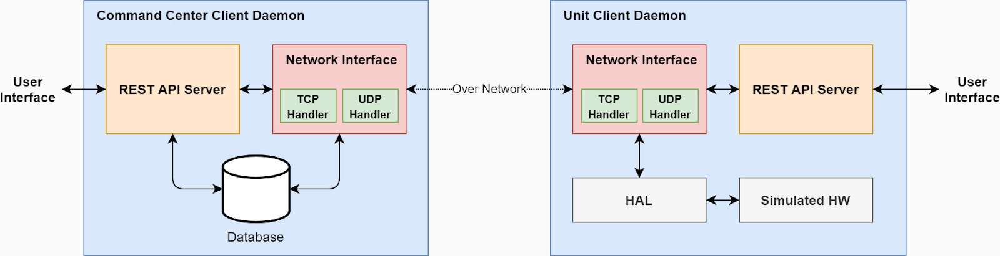
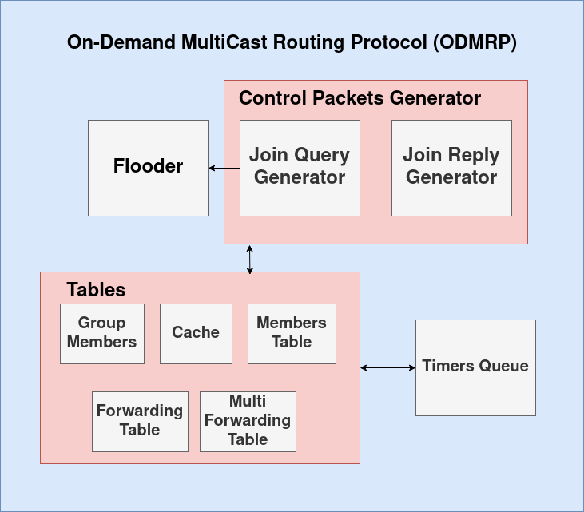
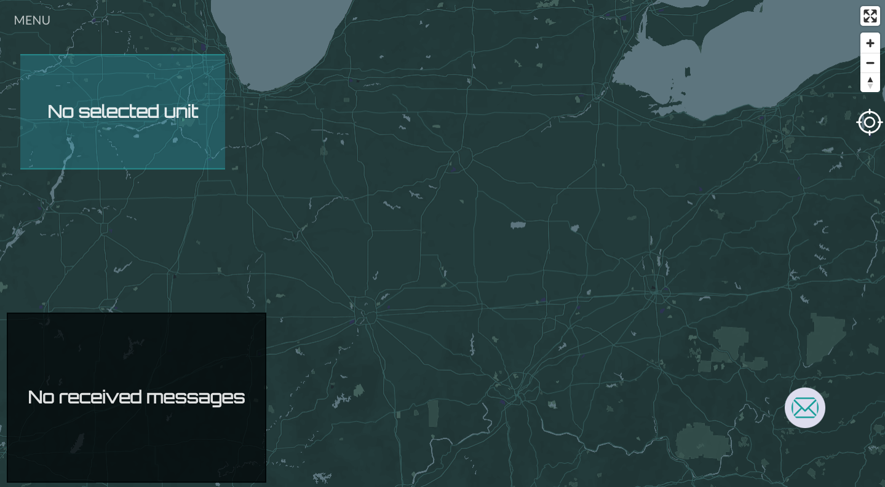
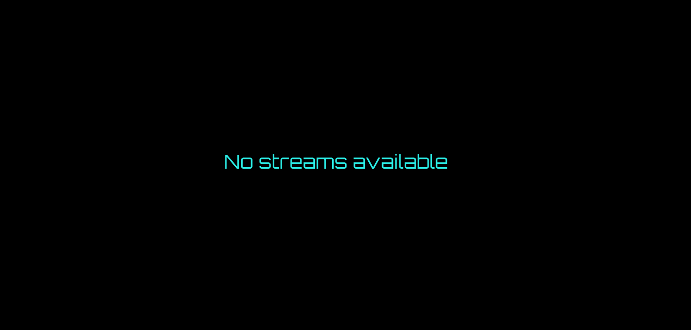
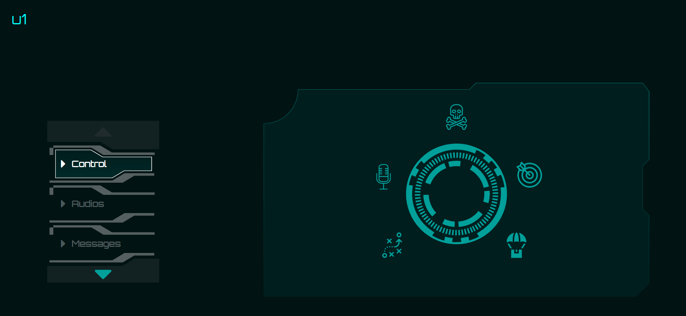
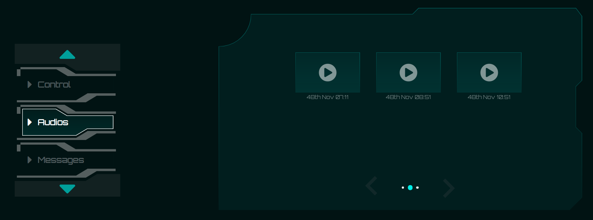
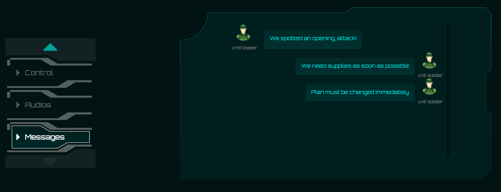
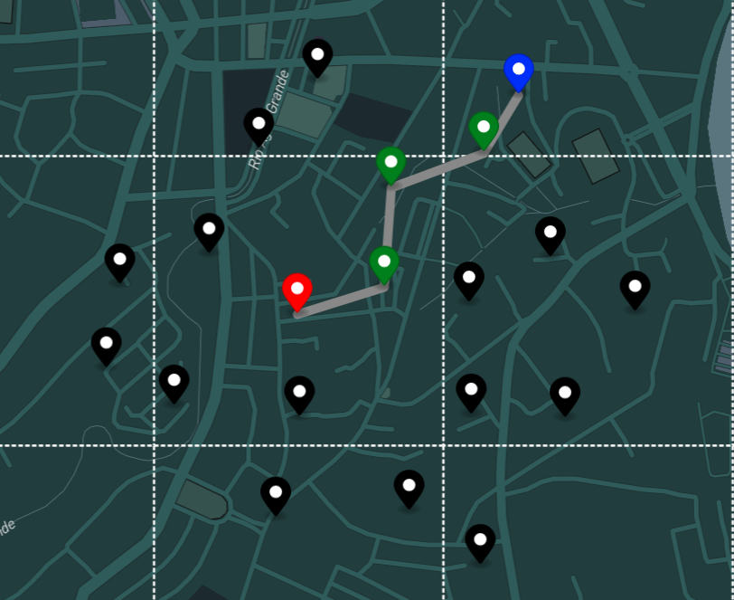

# C4IAN

> Pronounced "Kaian"
Tactical Mobile ad-hoc network.
Build a network on the go for tactical teams in war and emergency situations.

Supports video/audio streaming and messaging with unicast, multicast and broadcast cababilities.

## 📝 Table of Content
<!--ts-->
* [ Problem Statement. ](#problem-statement)
* [ Motivation. ](#motivation)
* [ System Architecture. ](#system-arch)
* [ Development. ](#development)
* [ Application Layer. ](#app-layer)
  * [Command Center Client. ](#cmd-app)
  * [Unit Client. ](#unit-app)
  * [Emulation Map. ](#emulation-map)
  * [Log Visualizer. ](#log-visualizer)
  * [ Demo. ](#demo)
* [Book](/docs/pdf/)[ (pdf) ](./docs/pdf/book.pdf)
* [Presentation](/docs/presentations/)
* [ Developers. ](#developers)


<!--te-->


## Problem Statement
<a name="problem-statement"></a>
Tactical teams face troubles to achieve scalable and reliable communications in the battlefield or during
emergencies due to the lack of a network infrastructure and the high mobility of units. They also need a
method to collect real time data and analyze it to have a competitive advantage in the battleground.

## Motivation
<a name="motivation"></a>
Mobile ad-hoc networks can be formed on the go, without any infrastructure. They promise more
flexibility and reliability than manual radio broadcasting. We are interested in building such complex
distributed systems.

## System Architecture 
<a name="system-arch"></a>






<a name="development"></a>
# Development
> Follow the rest of `README`s.

## Common Requirements
<a name="common-reqs"></a>
### golang 1.15.8
```
$ sudo apt update && sudo apt install -y wget && (
    set -e
    cd /tmp
    wget -c https://golang.org/dl/go1.15.8.linux-amd64.tar.gz
    sudo tar xvf go1.15.8.linux-amd64.tar.gz
    sudo chown -R root:root ./go
    sudo mv ./go /usr/local
    mkdir -p $HOME/.config/go/1.15/{bin,pkg,src}
    echo >>"$HOME"/.bashrc
    echo 'export GOPATH="$HOME/.config/go/1.15"' >>"$HOME"/.bashrc
    echo 'export PATH="$PATH:/usr/local/go/bin:$GOPATH/bin"' >>"$HOME"/.bashrc
    echo >>"$HOME"/.bashrc
    . "$HOME"/.bashrc
)
```
For `VSCode` support:
- Install [Go Extension](https://marketplace.visualstudio.com/items?itemName=golang.go).
- Install all the extension's recommended tools.
- Add `"go.gopath": "~/.config/go/1.15/"` to your `VSCode` settings.json file to enable `Go` extension tools.
- Open each golang project in its own `VSCode` session, e.g. `$ code src/router` to be able to use linter and gopls.

### Mininet-Wifi
`$ python --version`

If it's 3, you are good to go, otherwise do the following:

```
$ sudo mv /bin/python /bin/python.old
$ sudo ln /bin/python3 /bin/python
```

It may break your system, in this case reverse it back: `sudo m /bin/python.old /bin/python`

Then install mininet-wifi:

```
$ (
    set -e
    sudo apt update
    sudo apt install -y git
    cd /tmp
    git clone git://github.com/intrig-unicamp/mininet-wifi
    sudo mininet-wifi/util/install.sh -Wln
)
```

### yarn
### nodejs
### python3
### python3-pip
### python packages: websocket-client, numpy
```
sudo python3 -m pip install simple-websocket-server numpy
```
### socat

## Issues
- `electron: error while loading shared libraries: libgconf-2.so.4: cannot open shared object file: No such file or directory`

[Solution] Run:
```
$ sudo apt install -y libgconf-2-4
```

# Application Layer
<a name="app-layer"></a>

## Command Center Client
<a name="cmd-app"></a>
Command centers are responsible for the central administration and operational management
of a group of units. High-end computers with strong CPUs, high power consumption capabilities, and large storage and RAM capabilities are expected to be used as command center clients. The command centers are located near the operation field and have a wide wireless range, allowing them to link to a group of troops in the field. They’re assumed to have
limited (or no) mobility
### Units

### Map

### Video Streaming



## Unit Client
<a name="unit-app"></a>
### Home

### Audios

### Chatbox


# Emulation Map
<a name="emulation-map"></a>


## Log visualizer
<a name="log-visualizer"></a>


## Demo
<a name="demo"></a>

### English Demo Video
<div align="center">
  <a href="https://youtu.be/591PVS4rE8Y">
    
  </a>
</div>

### Arabic Demo Video

<div align="center">
  <a href="https://youtu.be/aT0k4FVapXM">
    
  </a>
</div>

# :copyright: Developers
<a name="developers"></a>

| Name                                |              Email               |
| ----------------------------------- | :------------------------------: |
| Abdulrahman Khalid Hassan           | abdulrahman.elshafei98@gmail.com |
| Ahmad Mahmoud AbdElMen'em           |   ahmed.afifi.cufe@gmail.com     |
| Mahmoud Othman Adas                 |   mido3ds@gmail.com              |
| Yosry Mohammad Yosry                |       yosrym93@gmail.com         |   
