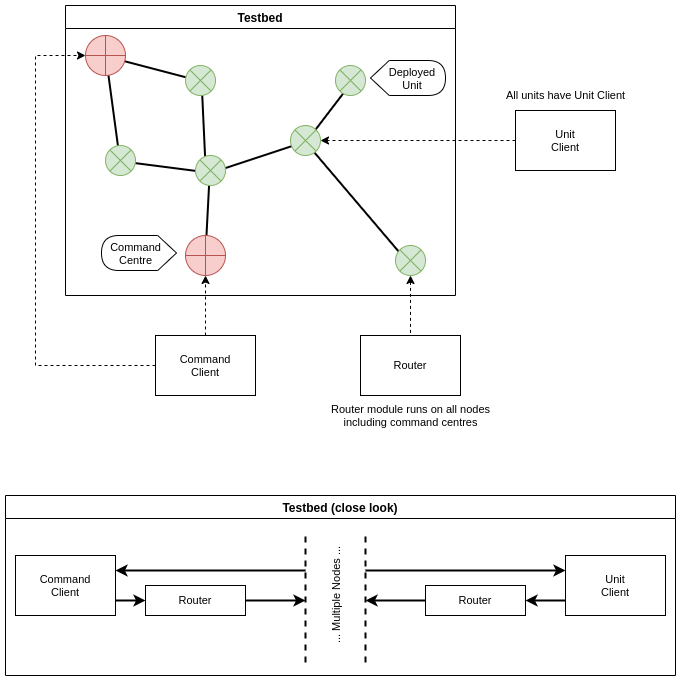

<!-- use this template before submitting https://drive.google.com/file/d/13Ot9Atu3ej9Qkhx067NDUw7WJr63n8wF/view?fbclid=IwAR2cSzbeAUklcX4H2SILcNGqgvFeBzn9GKeCGNjVsJfFKL69gAVUFI6j4T8 -->

# Team Members

| Name               | Email                                            |
|--------------------|--------------------------------------------------|
| Mahmoud Adas       | \texttt{mahmoud.ibrahim97@eng-st.cu.edu.eg}      |
| Yosry Mohammad     | \texttt{yosry.mohammad99@eng-st.cu.edu.eg}       |
| Ahmed Mahmoud      | \texttt{Ahmed.Afifi98@eng-st.cu.edu.eg}          |
| Abdulrahman Khalid | \texttt{abdulrahman.elshafie98@eng-st.cu.edu.eg} |

# Problem Statement
<!-- Introduction to the problem (max 30 words) -->
A `mobile ad-hoc network` communication system for military, for operations in areas with no internet infrastructure.
Deployed units can stream audio, video and sensors readings to command Centers.
Command Centers can stream audio and message codes to some/all unit(s).

# Motivation
<!-- Why are you motivated to work on this problem? (max 30 words) -->
The military needs to perform live data-analysis, communicate effectively over large distances.
Ad-hoc networks promise more flexibilty than manual radio broadcasting.

We are also interested in building distributed systems.

# System Architecture
<!-- In this section, draw the block diagram of your system showing the flow between
different modules. -->
Figure \ref{fig:modules} shows the modules diagram.

# List of Deliverables
<!-- State the main modules of your system with its function, inputs and expected outputs
- Number of modules must be at least equal to number of team members
- Max number of modules including the integration of whole project must not exceed 6
modules -->
| Module Name               | Function                                                                                          | Input                                                                                     | Expected Output                                            | % of used Libraries      |
|---------------------------|---------------------------------------------------------------------------------------------------|-------------------------------------------------------------------------------------------|------------------------------------------------------------|--------------------------|
| Unit Client               | Stream and receive streams to/from command centers                                                | Device audio, video, sensors and message codes. Streams and messages from command centers | Send streams and show play audio/messages                  | ~0% (not including `UI`) |
| Cmd. Center Client        | Stream and receive streams to/from deployed units. Shows a map of all units with their statistics | Audio and message codes. Streams and messages from deplyed units                          | Send streams and show play audio/messages                  | ~0% (not including `UI`) |
| Media Codec               | Capture video+audio, encode it, receive it and decode it                                          | Captured video/audio or encoded video/audio                                               | Encoded/Decoded video/audio                                | >90%                     |
| Node Discovery            | Build a map of nearby nodes for routing protocols                                                 | None                                                                                      | Necessary mapping of network topology                      | ~0%                      |
| Unicast+Broadcast Routing | Determine how to send a given `IP` packet to one destination or all nodes                         | `IP` packet from linux to send or forward                                                 | Packet accept/reject and updated forwarding/routing tables | ~0%                      |
| Multicast Routing         | Determine how to send a given `IP` packet to an `IP` group                                        | `IP` packet from linux to send or forward                                                 | Packet accept/reject and updated forwarding/routing tables | ~0%                      |

